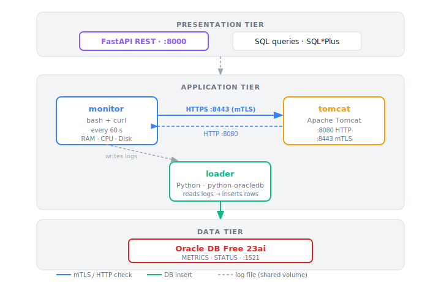

# linux-monitoring-stack

A three-tier monitoring stack running on Docker Compose. A **monitor** agent collects system metrics and checks service health, a **loader** persists the data into an **Oracle** database, and **Tomcat** acts as the monitored application server. mTLS secures all HTTPS communication between the monitor and Tomcat.

## Architecture



## Tech Stack

| Component          | Technology                                       |
| ------------------ | ------------------------------------------------ |
| Application server | Apache Tomcat (latest)                           |
| Monitoring agent   | Bash + curl                                      |
| Database loader    | Python 3 + python-oracledb                       |
| Database           | Oracle Database Free 23ai (`gvenzl/oracle-free`) |
| Security           | mTLS with self-signed CA                         |
| Orchestration      | Docker Compose                                   |

## Project Structure

```
linux-monitoring-stack/
├── certs/
│   ├── generate-certs.sh      # generates CA, server, and client certs
│   └── generated/             # output dir (gitignored)
├── loader/
│   ├── dockerfile
│   ├── requirements.txt
│   └── scripts/
│       └── loader.py          # reads logs, inserts into Oracle
├── logs/                      # shared volume (gitignored)
├── monitor/
│   ├── dockerfile
│   └── scripts/
│       └── health_check.sh    # collects metrics, checks Tomcat
├── sql/
│   └── queries/
│       ├── avg_ram_per_hour.sql
│       ├── http_errors_per_day.sql
│       ├── tomcat_uptime.sql
│       └── top5_cpu_pct.sql
├── tomcat/
│   ├── conf/
│   │   └── server.xml         # Tomcat config with mTLS connector
│   └── webapps/               # deploy apps here (gitignored)
├── docker-compose.yml
└── .env                       # secrets (gitignored)
```

## Setup

### Prerequisites

- Docker + Docker Compose
- OpenSSL (for cert generation)
- Git Bash or Linux shell

### 1. Configure environment

Create a `.env` file in the project root:

```env
ORACLE_PASSWORD=your_oracle_sys_password
APP_USER=app_user
APP_USER_PASSWORD=your_app_user_password
```

### 2. Generate mTLS certificates

```bash
cd certs
bash generate-certs.sh
```

This creates a local CA and signs two certificates: `tomcat` (server) and `monitor` (client). Output goes to `certs/generated/`.

### 3. Start the stack

```bash
docker-compose up --build -d
```

The `loader` container waits for Oracle to pass its healthcheck before starting. First startup takes a few minutes while Oracle initializes.

### 4. Verify

```bash
# Check all containers are running
docker-compose ps

# Tail monitor logs
docker logs monitor -f

# Tail loader logs
docker logs loader -f
```

## How It Works

### monitor

Runs every 60 seconds. Collects RAM, CPU, and disk usage, then performs three Tomcat health checks:

1. HTTP on port 8080
2. HTTPS on port 8443 **without** a client certificate (should fail — tests mTLS enforcement)
3. HTTPS on port 8443 **with** `monitor.crt` + `monitor.key` (should succeed)

Writes results to `/logs/` (shared Docker volume).

### loader

Reads the log files every 60 seconds and inserts any rows newer than the latest `MAX(TIME_STAMP)` in the database. Creates the `METRICS` and `STATUS` tables on first run (idempotent — checks `USER_TABLES` before issuing `CREATE TABLE`).

### mTLS

The CA (`ca.crt`) is self-signed and shared by both Tomcat and the monitor container at runtime. `ca.key` is only needed during cert generation. Tomcat's `SSLHostConfig` has `certificateVerification="required"` — connections without a valid client cert are rejected.

## Sample Output

### `logs/health-2026-06-18.log`

```
2026-06-18 09:06:08,17.28,677,3917,2,100.00
2026-06-18 09:07:08,68.73,2692,3917,2,0.00
2026-06-18 09:08:11,70.31,2754,3917,2,4.60
```

Format: `timestamp, RAM_PCT, RAM_USED_MB, RAM_TOTAL_MB, DISK_PCT, CPU_PCT`

### `logs/service-2026-06-18.log`

Three entries per minute — HTTP, mTLS without cert, mTLS with cert:

```
2026-06-18 10:02:27,404
2026-06-18 10:02:27,000
2026-06-18 10:02:27,404
```

`000` = connection rejected (no client cert). `404` = Tomcat responded (no webapp deployed, which is expected).

### `logs/alerts-2026-06-18.log`

```
2026-06-18 09:06:08,CPU ALERT: 100.00% > 90.00%
2026-06-18 09:25:26,CPU ALERT: 100.00% > 90.00%
```

Thresholds: CPU > 90%, RAM > 85%, Disk > 80%.

## SQL Queries

Connect via Oracle SQL\*Plus or any SQL client on port 1521 (service: `FREEPDB1`).

**Average RAM usage per hour:**

```sql
SELECT TO_CHAR(trunc(TIME_STAMP, 'HH24'), 'YYYY-MM-DD HH24:MI') AS hour,
       avg(RAM_PCT) AS avg_ram_pct
FROM METRICS
GROUP BY trunc(TIME_STAMP, 'HH24')
ORDER BY trunc(TIME_STAMP, 'HH24');
```

**HTTP errors per day:**

```sql
SELECT trunc(TIME_STAMP, 'DD') AS day, COUNT(HTTP_STATUS) AS error_count
FROM STATUS
WHERE HTTP_STATUS != 200
GROUP BY day
ORDER BY day;
```

**Tomcat uptime percentage:**

```sql
SELECT successes, total, ROUND(successes/total * 100, 2) AS uptime_pct
FROM (
    SELECT SUM(CASE WHEN HTTP_STATUS = 200 THEN 1 ELSE 0 END) AS successes,
           COUNT(*) AS total
    FROM STATUS
);
```

**Top 5 CPU spikes:**

```sql
SELECT TIME_STAMP, CPU_PCT
FROM METRICS
ORDER BY CPU_PCT DESC
FETCH FIRST 5 ROWS ONLY;
```

## Design Decisions

**Ephemeral database** — Oracle data is not persisted to a volume. Tables are recreated automatically on each startup via `check_if_table_exists()`. This is intentional for a dev/demo environment; adding a named volume to `docker-compose.yml` would make it persistent.

**Single HTTP_STATUS column in STATUS** — The service log writes three entries per minute but they all share the same schema (`TIME_STAMP`, `HTTP_STATUS`). Distinguishing check type (HTTP vs mTLS) would require a separate column or table; left as a conscious simplification.

**Self-signed CA** — No public CA is used. Both containers mount `certs/generated/` and trust the same `ca.crt`. The CA private key (`ca.key`) is only needed to sign certs and is not mounted at runtime.

**Secrets via `.env`** — Oracle passwords are passed through Docker Compose environment variables sourced from `.env`, which is gitignored.

## TODO

### Infrastructure

- [ ] `init.sh` — single script setup (`.env`, certs, `docker-compose up`)
- [ ] Nginx reverse proxy container (SSL termination, forward to Tomcat)
- [ ] Log rotation script (compress old logs, delete after X days)

### Backend

- [ ] FastAPI container — REST endpoints (`/metrics`, `/status`) querying Oracle
- [ ] SQL Views (`DAILY_SUMMARY`, etc.) as data layer for the API
- [ ] Alert email sender (Python `smtplib`, triggers on threshold breach)
- [ ] Daily report generator (HTML/PDF summary of metrics)

### Frontend

- [ ] React dashboard container — live charts (Chart.js) consuming FastAPI
- [ ] Uptime indicator, CPU/RAM graphs, HTTP status history

### Database

- [ ] Oracle `DBMS_SCHEDULER` job for in-DB metric aggregation
- [ ] Additional analytical queries (CPU vs HTTP errors correlation, peak alert hours)
